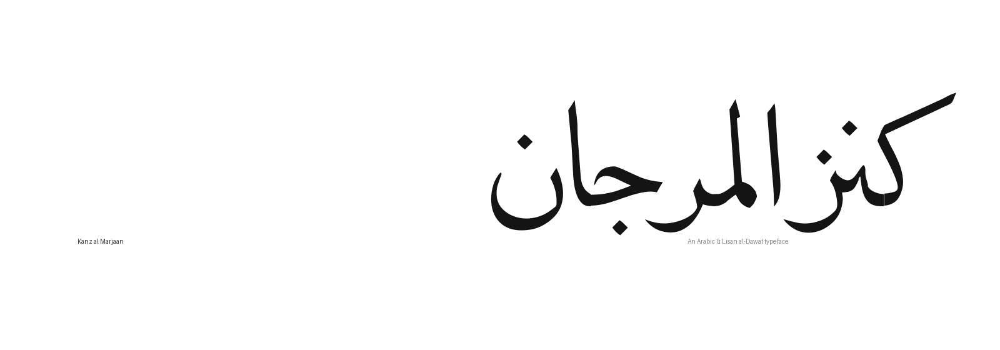
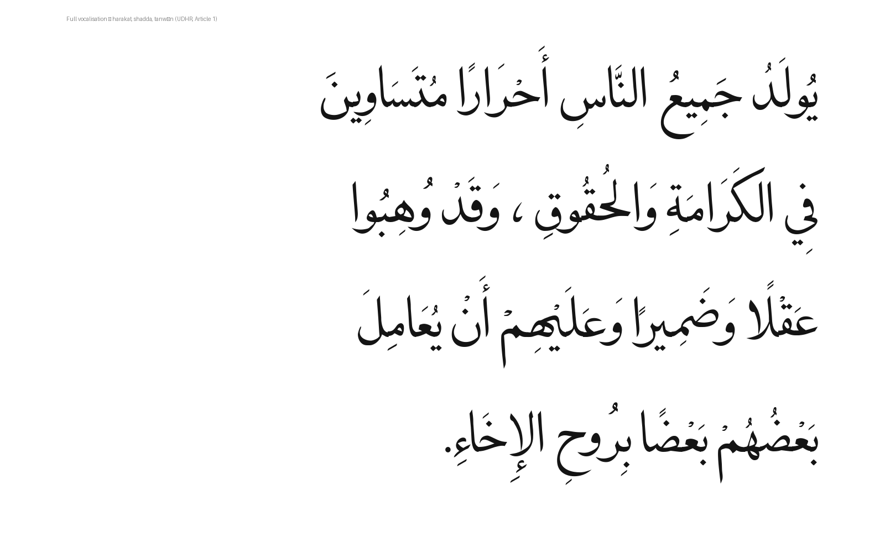
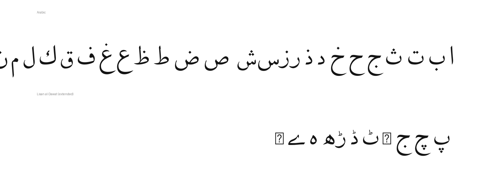

# Kanz al Marjaan



**Kanz al Marjaan** is an open-source Naskh typeface for the Arabic script. It is
built for fully **vocalised** text — every haraka, shadda, tanwīn and
dagger-alef is positioned with care, including across letters that join and
ligate — and it extends coverage to **Lisan al-Dawat**, an Arabic-script
orthography that adds a set of Gujarati-derived letters.

The family ships a single Regular weight as a static TTF, and is built with the
[Google Fonts](https://github.com/googlefonts/gftools) tooling.

## Samples

Fully vocalised Arabic (Universal Declaration of Human Rights, Article 1):



Character coverage — Arabic and the Lisan al-Dawat extensions:



## Features

- **Full vocalisation.** Harakat, shadda, tanwīn and the dagger-alef are
  anchored to sit cleanly on each letter — placed on the letter's visual centre,
  always clearing the consonant dots (a mark never falls between the rasm and its
  nuqta).
- **Per-component marks on ligatures.** Where letters fuse into a ligature, each
  component still carries its own haraka at the right place — across the standard
  Arabic ligatures and several hundred Lisan al-Dawat calligraphic forms — with
  the marks kept evenly spaced.
- **Lisan al-Dawat support.** Gujarati-derived letters and the script's
  calligraphic joining forms, alongside the full Arabic set.
- **Connected Naskh.** Cursive attachment and contextual joining for smooth,
  continuous letterforms, with entry/exit (curs) anchors aligned so joined
  letters meet on a common seam.
- **Clean, calligraphic outlines.** The outlines are debris-free and
  qalam-smoothed: residual auto-trace kinks are healed by modelling the reed
  pen's intent, so strokes stay continuous except at genuine pen events
  (terminal cuts, junctions, tooth tips). See *What's new in 2.5* below.
- **Google Fonts ready.** Naming, metadata, coverage and shaping follow the GF
  specification.

## What's new in 2.5

Version 2.5 combines two outline programs into a single best-of-both release:

- **Entry/exit alignment.** Cursive (curs) entry/exit anchors were corrected so
  connected Naskh joins meet cleanly, and the top i'raab on the final laam and
  final gaf was raised to clear the bowl.
- **Optimized outlines.** A debris-removal / faceted-curve pass followed by
  *qalam smoothing* healed shallow (3–25°) auto-trace kinks across the family —
  from ~4100 down to ~150 (a 96% reduction), every edit held within a 4-unit
  deviation guard. Glyph count, coverage (663 encoded characters) and metrics
  are unchanged from 2.000; only the outlines got cleaner.

## Building from source

The font is built from the UFO source in `sources/` with the gftools builder.

```sh
# Python 3.10 is recommended (matches CI)
python3.10 -m venv venv && source venv/bin/activate
pip install -r requirements.txt

# full build -> fonts/ttf/ + fonts/webfonts/
gftools builder sources/config.yaml

# quick single-master build while iterating
fontmake -u sources/KanzAlMarjaan-Regular.ufo -o ttf --output-path /tmp/KanzAlMarjaan.ttf
```

The `scripts/` directory contains the tooling used to develop and validate the
font: mark-positioning helpers (annotation-sheet generators, anchor
calibrators, the mark-to-ligature rollout generator, and a collision/
nuqta-overlap checker), the outline programs (`curve_cleanup.py`,
`qalam_smooth.py`), and the audit/regression gates (`curs_audit.py`,
`join_scan.py`, `outline_lint.py`). Render an old-vs-new outline comparison
with `compare_versions.py`.

## License

This font is licensed under the SIL Open Font License, Version 1.1 — see
[`OFL.txt`](OFL.txt). It may be used, studied, modified and redistributed freely
as long as it is not sold on its own. It includes work derived from Adobe's
Source family and from the Fatemi Maqala project (both OFL).

## Credits

Designed and maintained by the Kanz al Marjaan project authors (see
[`AUTHORS.txt`](AUTHORS.txt) and [`CONTRIBUTORS.txt`](CONTRIBUTORS.txt)).
Contributions and issue reports are welcome.
